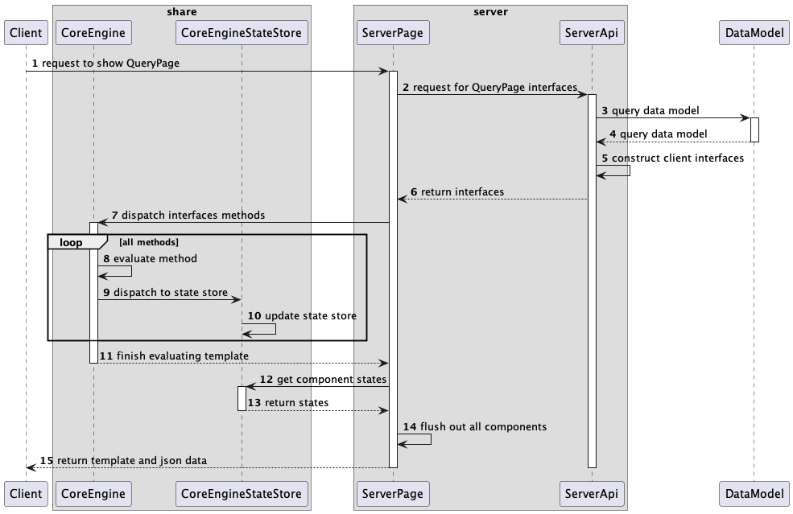
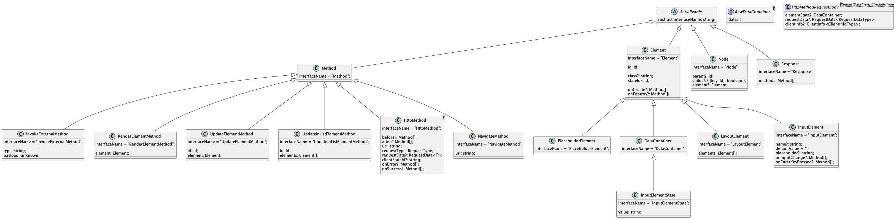

# Composer

## Architecture





Element and Method will be the main interface to structure the application. Element is the component
that you will see in the app when it is rendered, and method is the interaction when you do anything with
the component

### ROOT_ID

This is used to refer to the whole template. When we specify this ID, it means we want to replace the whole
page with a new component

### Methods

* `InvokeExternalMethod` will take in the type and payload. We can use this to dispatch any action to the state
  store. For example, we can use it to invoke `action.updateStateElement` with the data that we want to update
* `RenderElementMethod` is used as the core rendering method. We use this to render an element from the server api
  by instructing to render it at the ROOT_ID or any place that you know the id (placeholder_id)
* `UpdateElementMethod` is similar to RenderElementMethod, but instead of giving the element you can specify
  that you want to replace old element at `id` with a new element
* `UpdateInListElementMethod` is similar to UpdateElementMethod, but instead of updating 1 element you will
  replace that element with a list of elements instead. For example, if you have

```
root_element: [element_1, element_2, element_4]
``` 

you can replace the above element by instructing

```
UpdateInListElementMethod(element_2.id, [new_element_2, new_element_3])

root_element: [element_1, new_element_2, new_element_3, element_4]
```
* `HttpMethod` is used to invoke a server side skill. By default, you can instruct the skill to send anything
  via `requestData` from the server. For example,

```
HttpMethod {
  requestData: {
    data1: "some value"
  }
}
```

When invoking this in the client side, it will send back the server side that data in `HttpMethodRequestBody`.
You will be able to access it in requestData

```
export interface HttpMethodRequestBody<RequestDataType, ClientInfoType> {
  elementState?: DataContainer;
  requestData?: RequestData<RequestDataType>;
  clientInfo?: ClientInfo<ClientInfoType>;
}
```

`clientStateId` in HttpMethod will need to be associated with a `DataContainer`. Its responsibility is when
specified in the `HttpMethod` object, it will extract that `elementState` in the client and send it along
with the request to the server side

`clientInfo` is additional data that you want to send to server (for example, user preference, cookie, authtoken)
that we won't be able to get it or manipulate it in the server side

### Elements

* `DataContainer` is used to hold state and let other components update this state
* `PlaceholderElement` is used to represent a temporary component that can be later replaced when we have the
  correct component for that position. Placeholder usually has an `id` that is known to other elements

## Development

```bash
npm run dev
```

## Test

```bash
npm test
```

## Production

### Start production server

```bash
npm run build
npm start
```

Access `http://localhost:3000` to see the application
